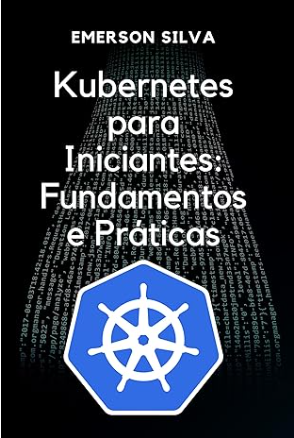

<!-- _paginate: false -->
<!-- _footer: "" -->
<style scoped>
section {
  display: flex;
  flex-direction: column;
  justify-content: center;
  align-items: center;
  height: 100%;
  text-align: center;
  padding: 80px;
  position: relative;
}
h1 {
  font-size: 2.2rem;
  font-weight: 800;
  background: linear-gradient(135deg, #00E6CC 0%, #00E6CC 100%);
  -webkit-background-clip: text;
  -webkit-text-fill-color: transparent;
  background-clip: text;
  margin-bottom: 0.8rem;
  line-height: 1.1;
  letter-spacing: -0.02em;
  text-shadow: none;
}
h2 {
  font-size: 1.8rem;
  color: #F8FAFC;
  font-weight: 400;
  margin-bottom: 3rem;
  opacity: 0.9;
  position: relative;
}
h2::before {
  content: "";
  position: absolute;
  left: 50%;
  transform: translateX(-50%);
  top: -15px;
  width: 500px;
  height: 3px;
  background: linear-gradient(90deg, #00E6CC 0%, #f15a29 100%);
  border-radius: 2px;
}
h3 {
  font-size: 1.3rem;
  color: #4ECDC4;
  font-weight: 500;
  margin: 0.20rem 0;
  letter-spacing: 0.5px;
}
h3:last-of-type {
  color: #f15a29;
  font-weight: 4300;
  margin-top: 1rem;
  font-size: 1.2rem;
}
</style>

# Kubernetes: o que é esse negócio que todo mundo fala
### Emerson Silva
### DOUGBR Meetup · [UNIFAAT](https://www.unifaat.com.br/) · Atibaia

<div style="display:flex; justify-content:center; align-items:center; gap:40px; margin-top:1.5rem;">
  
</div>

---
<!-- _paginate: false -->


# Emerson Silva

* Engenheiro DevOps/SRE na **4Linux**
* +9 anos em ambientes DevOps críticos
* Foco em **Kubernetes**, IaC e confiabilidade
* Escritor, instrutor e palestrante ativo na comunidade

---
<!-- _paginate: false -->
<!-- _footer: "" -->
<style scoped>
section {
  padding: 50px 60px 70px 60px;
}
h2 {
  font-size: 1.4em;
  color: #8B9DC3;
  font-weight: 400;
  margin-bottom: 0.3em;
  letter-spacing: 0.05em;
  text-transform: uppercase;
}
h2::before { display: none; }
section { text-align: center; }
p {
  font-size: 0.85em;
  color: #c8d4e8;
  line-height: 1.6;
  max-width: 72%;
  margin: 0 auto 1.6em auto;
  text-align: center;
}
.timeline {
  display: flex;
  align-items: flex-start;
  gap: 0;
  width: 100%;
  margin-top: 0.5em;
  position: relative;
}
.timeline::before {
  content: "";
  position: absolute;
  top: 22px;
  left: 0;
  right: 0;
  height: 2px;
  background: linear-gradient(90deg, #00E6CC, #4ECDC4, #f15a29);
}
.tl-item {
  flex: 1;
  text-align: center;
  position: relative;
  padding-top: 40px;
}
.tl-item::before {
  content: "";
  position: absolute;
  top: 16px;
  left: 50%;
  transform: translateX(-50%);
  width: 12px;
  height: 12px;
  border-radius: 50%;
  background: #00E6CC;
  border: 2px solid #0B1426;
  z-index: 1;
}
.tl-year {
  font-size: 0.9em;
  font-weight: 700;
  color: #00E6CC;
  display: block;
}
.tl-label {
  font-size: 0.6em;
  color: #8B9DC3;
  display: block;
  margin-top: 2px;
  line-height: 1.2;
}
</style>


Fundada em 2001, a 4Linux participou das principais transformações da área de tecnologia. Começamos com Linux e software livre, navegamos por Cloud, DevOps e Containers — e hoje atuamos com agentes de IA, sempre com base em **inovação aberta**.

<div class="timeline">
  <div class="tl-item"><span class="tl-year">2001</span><span class="tl-label">Linux &<br>Software Livre</span></div>
  <div class="tl-item"><span class="tl-year">2008</span><span class="tl-label">DevOps</span></div>
  <div class="tl-item"><span class="tl-year">2016</span><span class="tl-label">Containers &<br>Kubernetes</span></div>
  <div class="tl-item"><span class="tl-year">2019</span><span class="tl-label">Machine<br>Learning</span></div>
  <div class="tl-item"><span class="tl-year">2020</span><span class="tl-year" style="color:#4ECDC4">Cloud</span></div>
  <div class="tl-item"><span class="tl-year">2024+</span><span class="tl-label">IA com<br>Open Source</span></div>
</div>

---
<!-- _paginate: false -->

## O que veremos hoje

1. A evolução: bare metal → VMs → containers
2. O problema de gerenciar containers em escala
3. Como surgiu o Kubernetes
4. O que é e como funciona
5. Quando usar (e quando não usar)
6. Vantagens e certificações
7. Os principais objetos
8. Deploy na prática: Snake Classic no K8s

---

## A evolução da infraestrutura

<style scoped>
table { font-size: 0.80em; width: 100%; }
th { background: rgba(0,230,204,0.12); color: #00E6CC; padding: 8px 16px; }
td { padding: 8px 16px; border-bottom: 1px solid rgba(255,255,255,0.06); }
td:first-child { color: #8B9DC3; font-style: italic; }
</style>

| | **Bare Metal** | **Máquinas Virtuais** | **Containers** |
|---|---|---|---|
| Isolamento | Total (hardware) | Parcial (hypervisor) | Processo (kernel) |
| Inicialização | Minutos | Segundos a minutos | Milissegundos |
| Overhead | Zero | Médio (SO completo) | Mínimo |
| Portabilidade | Baixa | Média | Alta |

> Containers são rápidos, leves e portáveis — mas gerenciar **muitos** deles é um desafio

---

## O que é um container?

<style scoped>
pre { font-size: 0.72em; }
</style>

```
                                ┌─────────────────────────────────────┐
                                │            Container                │
                                │  ┌─────────────────────────────┐    │
                                │  │  sua aplicação              │    │
                                │  │  + dependências             │    │
                                │  │  + bibliotecas              │    │
                                │  │  + variáveis de ambiente    │    │
                                │  └─────────────────────────────┘    │
                                │         compartilha o kernel        │
                                └──────────────┬──────────────────────┘
                                               │
                                      Sistema Operacional Host
```

> Um container empacota a aplicação **e tudo que ela precisa para rodar** — e roda de forma isolada no mesmo kernel do host

---

## Container vs Máquina Virtual

<style scoped>
pre { font-size: 0.62em; }
</style>

```
                      Máquina Virtual                    Container
                  ┌──────────────────────┐        ┌──────────────────────┐
                  │   App A   │  App B   │        │   App A   │  App B   │
                  ├───────────┼──────────┤        ├───────────┼──────────┤
                  │  Sistema  │ Sistema  │        │   Libs    │   Libs   │
                  │Operacional│Operacional        ├───────────┴──────────┤
                  ├───────────┴──────────┤        │   Container Runtime  │
                  │      Hypervisor      │        ├──────────────────────┤
                  ├──────────────────────┤        │  Sistema Operacional │
                  │       Hardware       │        ├──────────────────────┤
                  └──────────────────────┘        │       Hardware       │
                                                  └──────────────────────┘
                    SO completo por app (GBs)       Só o necessário (MBs)
```

---

## O problema de escala

Imagina sua aplicação rodando em **10 containers**. Tudo certo.

Agora imagina **200 containers**, em **8 servidores diferentes**:

* Em qual servidor sobe cada container?
* Como garantir que o container reinicia se cair?
* Como distribuir carga entre as réplicas?
* Como fazer update sem derrubar o serviço?
* Como os containers se comunicam entre servidores?

> Fazer isso na mão é inviável. Você precisa de um **orquestrador**.

---
<!-- _paginate: false -->
<style scoped>
section {
  display: flex;
  justify-content: center;
  align-items: center;
  height: 100%;
  text-align: center;
}
h2 {
  font-size: 3rem;
  color: #00E6CC;
  text-shadow: 0 0 20px rgba(0, 230, 204, 0.5);
}
</style>

## É aqui que entra o Kubernetes

---

## Como surgiu o Kubernetes

* **2003** — Google cria o **Borg**, sistema interno de orquestração
* Borg gerenciava *bilhões* de containers por semana nos data centers do Google
* **2013** — Google inicia projeto baseado nas lições do Borg
* **Junho de 2014** — Kubernetes anunciado publicamente
* **2016** — Doado para a **CNCF** (Cloud Native Computing Foundation)
* **Hoje** — padrão da indústria, com contribuições de centenas de empresas

> O nome vem do grego: **κυβερνήτης** — timoneiro, piloto de navio

---

## O que é Kubernetes

> **Kubernetes** é um sistema open source de orquestração de containers que automatiza o deploy, escalabilidade e gerenciamento de aplicações containerizadas.

Em termos simples:

* Você diz **o que quer** — "quero 3 réplicas da minha app rodando"
* Kubernetes cuida do **como** — em qual nó, como manter, como recuperar

**Kubernetes não substitui o Docker** — ele usa o Docker (ou outro runtime) por baixo dos panos

---

## Arquitetura: visão geral

<style scoped>
pre { font-size: 0.72em; }
</style>

```
┌─────────────────────────────────────────────────┐
│                 CONTROL PLANE                   │
│  ┌───────────┐ ┌──────┐ ┌────────────────────┐  │
│  │ API Server│ │ etcd │ │Scheduler+Controller│  │
│  └───────────┘ └──────┘ └────────────────────┘  │
└──────────────────────┬──────────────────────────┘
                       │ gerencia
        ┌──────────────┼──────────────┐
        ▼              ▼              ▼
┌──────────────┐ ┌──────────────┐ ┌──────────────┐
│  Worker Node │ │  Worker Node │ │  Worker Node │
│  ┌────────┐  │ │  ┌────────┐  │ │  ┌────────┐  │
│  │ Pod(s) │  │ │  │ Pod(s) │  │ │  │ Pod(s) │  │
│  └────────┘  │ │  └────────┘  │ │  └────────┘  │
│  kubelet     │ │  kubelet     │ │  kubelet     │
└──────────────┘ └──────────────┘ └──────────────┘
```

---

## Control Plane: o cérebro do cluster

* **API Server** — porta de entrada para tudo; toda interação passa por aqui (`kubectl` fala com ele)
* **etcd** — banco de dados distribuído; armazena o estado completo do cluster
* **Scheduler** — decide em qual nó cada Pod vai rodar
* **Controller Manager** — garante que o estado real bate com o desejado

> Se você pede "quero 3 réplicas", o Controller Manager é quem percebe que caiu uma e sobe outra

---

## Worker Node: onde as aplicações rodam

* **kubelet** — agente em cada nó; recebe ordens do control plane e garante que os containers estão rodando
* **kube-proxy** — cuida das regras de rede e roteamento de tráfego entre pods
* **Container Runtime** — quem realmente executa os containers (containerd, CRI-O)

> O control plane **gerencia**, os worker nodes **executam**

---

## Quando usar Kubernetes

<style scoped>
table { font-size: 0.82em; width: 100%; }
th { background: rgba(0,230,204,0.12); color: #00E6CC; padding: 8px 16px; }
td { padding: 8px 16px; border-bottom: 1px solid rgba(255,255,255,0.06); }
</style>

| **Use Kubernetes quando...** | **Talvez não precise quando...** |
|---|---|
| Muitos microsserviços para gerenciar | É um projeto pequeno ou MVP |
| Precisa de alta disponibilidade | Time pequeno, pouca experiência |
| Escala horizontal frequente | Monólito simples e estável |
| Times diferentes deployando em paralelo | Custo operacional é restrição crítica |
| Multi-cloud ou portabilidade é requisito | Uma VM simples resolve o problema |

> Kubernetes resolve problemas de escala. Se você não tem esse problema, talvez seja overkill.

---

## Vantagens do Kubernetes

* **Self-healing** — se um container cai, o K8s reinicia automaticamente
* **Auto-scaling** — escala pods horizontalmente conforme a demanda
* **Rolling updates** — atualiza a aplicação sem downtime
* **Rollback** — voltou pra versão anterior em um comando
* **Portabilidade** — roda igual na AWS, GCP, Azure ou on-premise
* **Service discovery** — pods se encontram pelo nome, sem IP fixo
* **Gerenciamento de configuração** — ConfigMaps e Secrets nativos

---
<!-- _paginate: false -->
<style scoped>
section {
  display: flex;
  justify-content: center;
  align-items: center;
  height: 100%;
  text-align: center;
}
h2 {
  font-size: 2.4rem;
  color: #00E6CC;
  font-weight: 600;
  line-height: 1.4;
}
</style>

## Os principais objetos do Kubernetes

---

## Pod: a menor unidade

<style scoped>
pre { font-size: 0.62em; }
</style>

> Um **Pod** é o menor objeto do Kubernetes — agrupa um ou mais containers que compartilham rede e armazenamento.

```yaml
apiVersion: v1
kind: Pod
metadata:
  name: meu-app
spec:
  containers:
  - name: app
    image: nginx:1.25
    ports:
    - containerPort: 80
```

* Na prática, você quase nunca cria Pods diretamente
* Pods são criados e gerenciados por objetos de nível superior

---

## Deployment: gerencia seus Pods

<style scoped>
pre { font-size: 0.62em; }
</style>

> Um **Deployment** declara quantas réplicas de um Pod devem existir e como atualizar a aplicação.

```yaml
apiVersion: apps/v1
kind: Deployment
metadata:
  name: meu-app
spec:
  replicas: 3
  selector:
    matchLabels:
      app: meu-app   # Liga o Deployment aos Pods pelo label
```

---

## Deployment: definindo o container

<style scoped>
pre { font-size: 0.62em; }
</style>

```yaml
  template:           # molde de cada Pod que será criado
    metadata:
      labels:
        app: meu-app
    spec:
      containers:
      - name: app
        image: nginx:1.25
        ports:
        - containerPort: 80
```

* Se um Pod cair, o Deployment recria automaticamente
* Para escalar: `kubectl scale deployment meu-app --replicas=5`
* Para atualizar a imagem: `kubectl set image deployment/meu-app app=nginx:1.26`

---

## Service: expõe seus Pods

<style scoped>
pre { font-size: 0.62em; }
</style>

> Um **Service** cria um ponto de acesso estável para os Pods — os Pods mudam, o Service permanece.

```yaml
apiVersion: v1
kind: Service
metadata:
  name: meu-app
spec:
  selector:
    app: meu-app
  ports:
  - port: 80
    targetPort: 80
  type: ClusterIP   # interno | NodePort | LoadBalancer
```

---

## Service: tipos de exposição

* **ClusterIP** — acesso só de dentro do cluster. Padrão. Ideal para comunicação entre serviços internos.
* **NodePort** — expõe uma porta fixa (30000–32767) em cada nó do cluster. Útil para testes e desenvolvimento.
* **LoadBalancer** — provisiona automaticamente um load balancer externo na nuvem (AWS ELB, GCP LB...). Usado em produção.

> Para ambientes locais (minikube), use **NodePort** ou `kubectl port-forward`

---

## Namespace: isolamento lógico

<style scoped>
pre { font-size: 0.62em; }
</style>

> **Namespaces** dividem o cluster em ambientes isolados — útil para separar times, projetos ou ambientes.

```bash
kubectl get namespaces
# default       Active   5d
# kube-system   Active   5d   ← componentes do K8s
# kube-public   Active   5d
# monitoring    Active   2d   ← seu namespace
```

```bash
kubectl create namespace staging
kubectl apply -f app.yaml -n staging
```

> Sem namespace especificado, tudo vai para o **default**

---

## ConfigMap: configurações não-sensíveis

<style scoped>
pre { font-size: 0.62em; }
</style>

> Separa a configuração do código — sem precisar rebuildar a imagem para mudar um valor.

```yaml
apiVersion: v1
kind: ConfigMap
metadata:
  name: app-config
data:
  APP_ENV: "producao"
  LOG_LEVEL: "info"
  DB_HOST: "postgres-service"
```

---

## ConfigMap: injetando no container

<style scoped>
pre { font-size: 0.62em; }
</style>

```yaml
# opção 1 — injeta todas as chaves de uma vez
envFrom:
  - configMapRef:
      name: app-config

# opção 2 — injeta chave por chave
env:
  - name: APP_ENV
    valueFrom:
      configMapKeyRef:
        name: app-config
        key: APP_ENV
```

> Mudou a config? Atualiza o ConfigMap e reinicia os pods — sem rebuild de imagem.

---

## Secret: dados sensíveis

<style scoped>
pre { font-size: 0.62em; }
</style>

> Igual ao ConfigMap, mas para senhas, tokens e chaves. Valores em **base64**.

```yaml
apiVersion: v1
kind: Secret
metadata:
  name: app-secret
data:
  DB_PASSWORD: c2VuaGEtc2VjcmV0YQ==   # base64 de "senha-secreta"
  API_TOKEN: bXl0b2tlbnNlY3JldA==
```

```bash
# como gerar o valor base64
echo -n "senha-secreta" | base64
```

---

## Secret: injetando e boas práticas

<style scoped>
pre { font-size: 0.62em; }
</style>

```yaml
envFrom:
  - secretRef:
      name: app-secret
```

* Base64 é **encoding**, não criptografia — qualquer um pode decodificar
* Nunca commite Secrets no Git em texto puro
* Para produção: use **Sealed Secrets** (criptografia no Git) ou **Vault** (gerenciador externo)
* Clouds oferecem alternativas nativas: AWS Secrets Manager, GCP Secret Manager

---
<!-- _paginate: false -->
<style scoped>
section {
  display: flex;
  justify-content: center;
  align-items: center;
  height: 100%;
  text-align: center;
}
h2 {
  font-size: 2.8rem;
  color: #00E6CC;
  font-weight: 700;
  text-shadow: 0 0 20px rgba(0, 230, 204, 0.5);
}
p {
  font-size: 1.2rem;
  color: #4ECDC4;
}
</style>

## Hora do deploy!

Vamos rodar o Snake Classic no Kubernetes

---
<!-- _footer: "" -->

## Deploy: silvemerson/snake-classic

```yaml
# snake.yaml
apiVersion: apps/v1
kind: Deployment
metadata:
  name: snake-classic
spec:
  replicas: 1
  selector:
    matchLabels:
      app: snake-classic
  template:
    metadata:
      labels:
        app: snake-classic
    spec:
      containers:
      - name: snake-classic
        image: silvemerson/snake-classic:0.1
        ports:
        - containerPort: 8080
```

---
<!-- _footer: "" -->

## Expondo o jogo com um Service

```yaml
apiVersion: v1
kind: Service
metadata:
  name: snake-classic
spec:
  selector:
    app: snake-classic
  type: NodePort
  ports:
  - port: 80
    targetPort: 8080
    nodePort: 30080
```

---

## Comandos para subir o deploy

```bash
# sobe o cluster kind com port mapping
kind create cluster --config kind/cluster.yaml

# aplica Deployment e Service
kubectl apply -f kind/snake.yaml

# acompanha o pod subindo
kubectl get pods -w

# acessa via port-forward (alternativa)
kubectl port-forward service/snake-classic 8080:80
```

Acesse **http://localhost:8080** e jogue! 🕹️

---

## O que aconteceu por baixo dos panos

```
1. kubectl apply  →  API Server recebe o YAML
2. API Server     →  salva o estado desejado no etcd
3. Scheduler      →  escolhe um Worker Node disponível
4. kubelet        →  recebe a tarefa e instrui o containerd
5. containerd     →  faz pull da imagem silvemerson/snake-classic
6. Container      →  sobe e escuta na porta 8080
7. kube-proxy     →  configura o roteamento do NodePort
8. Service        →  balanceia o tráfego até o Pod
```

> Tudo isso em segundos, de forma declarativa

---

## Certificações Kubernetes (CNCF)

<style scoped>
table { font-size: 0.75em; width: 100%; }
th { background: rgba(0,230,204,0.12); color: #00E6CC; padding: 6px 14px; }
td { padding: 6px 14px; border-bottom: 1px solid rgba(255,255,255,0.06); }
td:first-child { color: #00E6CC; font-weight: bold; }
</style>

| Certificação | Foco | Tipo |
|---|---|---|
| **KCNA** | Fundamentos de K8s e Cloud Native | Teórica |
| **KCSA** | Fundamentos de segurança Cloud Native | Teórica |
| **CKAD** | Desenvolver e fazer deploy de apps no K8s | Prática |
| **CKA** | Administrar e operar clusters K8s | Prática |
| **CKS** | Segurança avançada em Kubernetes | Prática |

* Provas práticas: 2h resolvendo problemas em cluster real — sem múltipla escolha
* Reconhecidas globalmente · Recomendação: comece pela **KCNA** ou **CKAD**

---

## KubeAstronaut 🚀

<style scoped>
section { font-size: 26px; }
h2::before { display: none; }
h2 { text-align: center; font-size: 2rem; color: #00E6CC; }
.astro-box {
  background: linear-gradient(135deg, rgba(0,230,204,0.08), rgba(241,90,41,0.08));
  border: 2px solid rgba(0,230,204,0.4);
  border-radius: 16px;
  padding: 1.2rem 2rem;
  text-align: center;
  margin: 1rem 0;
}
</style>

<div class="astro-box">

Quem conquista as **5 certificações** (KCNA + KCSA + CKAD + CKA + CKS) recebe o título de **KubeAstronaut** da CNCF — reconhecimento máximo do ecossistema Kubernetes

</div>

* Título vitalício renovável — reconhecido mundialmente pela comunidade CNCF
* Badge oficial que pode ser exibido no LinkedIn e currículo
* Acesso a uma comunidade exclusiva de especialistas Kubernetes
* Representa domínio completo: do desenvolvimento à operação e segurança

> Uma jornada, não uma prova — cada cert tem seu valor independente

---
<!-- _footer: "" -->

## Conclusão

<style scoped>
ul {
  list-style: none;
  margin: 0;
  padding: 0;
  display: grid;
  grid-template-columns: repeat(3, 1fr);
  gap: 1.5rem;
  margin-bottom: 1.5rem;
}
li {
  background: rgba(26, 26, 26, 0.6);
  border: 1px solid rgba(0, 230, 204, 0.2);
  border-radius: 12px;
  padding: 1.5rem;
  text-align: center;
  position: relative;
  font-size: 0.85em;
}
li::before {
  content: "";
  position: absolute;
  top: 0; left: 0; right: 0;
  height: 3px;
  background: linear-gradient(90deg, #00E6CC 0%, #f15a29 100%);
  border-radius: 12px 12px 0 0;
}
strong { color: #00E6CC; }
.final-message {
  background: linear-gradient(135deg, rgba(0,230,204,0.1), rgba(241,90,41,0.1));
  border: 2px solid rgba(0,230,204,0.3);
  border-radius: 12px;
  padding: 0.5rem 2rem;
  text-align: center;
}
.final-message p { font-size: 1.0rem; color: #F8FAFC; font-weight: 500; margin: 0; }
</style>

* **Surgiu no Google** — baseado no Borg, open source em 2014
* **Orquestra containers** — cuida de deploy, escala e recuperação
* **Declarativo** — você descreve o que quer, ele resolve o como

<div class="final-message">
  <p>Kubernetes é <strong>complexo</strong>, mas os primeiros passos são <strong>simples</strong> — e valem muito a pena</p>
</div>

---
<!-- _paginate: false -->
<style scoped>
section {
  display: flex;
  flex-direction: column;
  justify-content: center;
  align-items: center;
  text-align: center;
}
h2 {
  font-size: 1.3rem;
  color: #00E6CC;
  line-height: 1.3;
  margin: 0 0 0.6rem 0;
}
h2::before { display: none; }
p { margin: 0.2rem 0; }
</style>



## Kubernetes para Iniciantes: Fundamentos e Práticas

**Emerson Silva**

**Gratuito na Amazon - Mas amanhã, pq esqueci de ativar pra hj :(**

Escaneie para acessar na Amazon:


---
<!-- _paginate: false -->

## Obrigado!


### Por onde continuar

* 📖 kubernetes.io/docs — documentação oficial
* 🎮 killercoda.com — labs interativos gratuitos
* 🎓 training.linuxfoundation.org — preparação CKA/CKAD
* 📝 emerson-silva.blog.br

Vamos manter contato!
